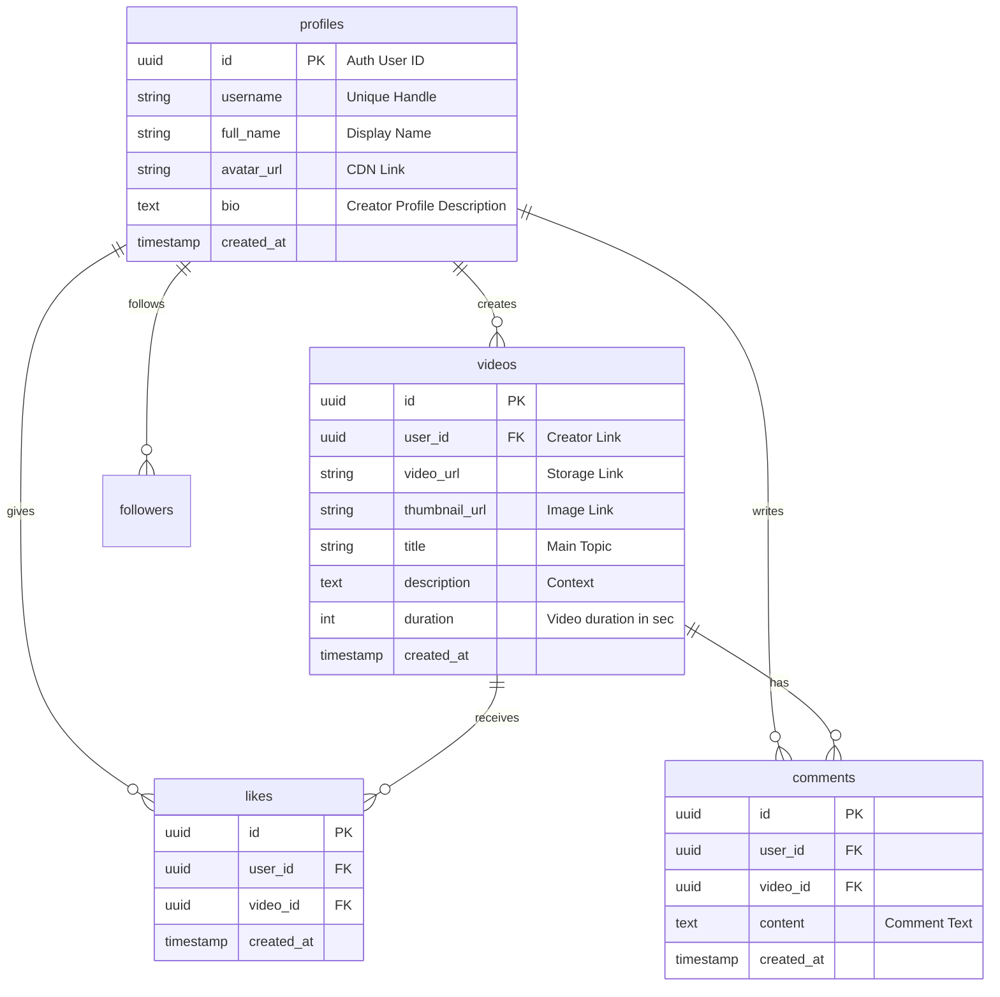

#  Orvelis — Cognitive Feed Platform

<p align="center">
  
  
  
  
  
</p>

---

## 👁️ Философия и Видение

**Orvelis** — это высокотехнологичная образовательная платформа в формате вертикального видео (TikTok-style), созданная как противовес хаотичному развлекательному контенту. Наша цель — направить естественную привычку скроллинга в русло интеллектуального роста, глубокого анализа и качественного обучения.

> [!NOTE]  
> **Миссия проекта:** Трансформировать «клиповое мышление» в инструмент быстрого получения структурированных знаний. Мы фильтруем шум, оставляя только логику, факты и смыслы.

---

## ⚡ Ключевые Архитектурные Фичи

*   **Premium Loop Player**: Бесшовное полноэкранное воспроизведение видео в портретном режиме без полей и артефактов на базе `expo-video` / `expo-av`.
*   **Cognitive Physics Engine**: Умный свайп-движок с физикой жестов (`react-native-gesture-handler` + `reanimated`), обеспечивающий 60 FPS интерфейс.
*   **Intella-Core & Battles**: Система интеллектуальных челленджей и баттлов, где пользователи соревнуются силой аргументов, а сообщество оценивает логику и факты.
*   **Zero-Lag Feed**: Интеллектуальный предзагрузчик видео для мгновенного старта воспроизведения без буферизации.
*   **Glassmorphic Design System**: Интерфейс премиум-класса с темной палитрой Obsidian Blue и динамическими размытиями.

---

## 📂 Структура Проекта (Enterprise-Grade)

```text
orvelis/
├── assets/                    # Оптимизированные графические ресурсы и шрифты
├── scripts/                   # Вспомогательные скрипты развертывания и тестирования
├── src/
│   ├── app/                   # Роутинг на базе Expo Router (File-system routing)
│   │   ├── (tabs)/            # Главные вкладки приложения
│   │   │   ├── index.tsx      # Персональная лента (Main Vertical Feed)
│   │   │   ├── discover.tsx   # Интеллектуальный поиск, категории и тренды
│   │   │   ├── create.tsx     # Студия записи и импорта видеоконтента
│   │   │   └── profile.tsx    # Профиль создателя (Аналитика, Челленджи, Портфолио)
│   │   ├── auth/              # Безопасная аутентификация
│   │   │   └── login.tsx      # Форма входа / KYC-регистрации
│   │   └── _layout.tsx        # Глобальный провайдер контекстов и разметки
│   ├── components/            # Переиспользуемые UI-компоненты
│   │   ├── VideoPlayer/       # Низкоуровневая обертка над видео-плеером
│   │   ├── VideoFeed/         # Оптимизированный Virtual List для свайпа видео
│   │   └── UI/                # Атомарные элементы (кнопки, блюры, инпуты)
│   ├── design-system/         # Токены дизайн-системы
│   │   └── theme.ts           # Цветовая палитра Obsidian Blue и типографика
│   ├── lib/                   # Интеграции со сторонними сервисами
│   │   └── supabase/          # Клиент, хелперы и хуки для работы с Supabase
│   └── store/                 # Глобальный стейт приложения (Zustand)
├── .env                       # Переменные окружения (подлежит скрытию!)
├── app.json                   # Конфигурация Expo-клиента
└── package.json               # Зависимости и скрипты сборки
```

---

## 🛠️ Технологический Стек

| Слой | Технология | Описание |
| :--- | :--- | :--- |
| **Frontend** | React Native (Expo SDK 54) | Кроссплатформенная разработка с нативной производительностью |
| **Навигация** | Expo Router v3 | Роутинг на базе структуры каталогов, оптимизированный под глубокие ссылки |
| **Анимации** | Reanimated 4 & Worklets | Плавные 60 FPS интерфейсы с вычислением физики на UI-потоке |
| **Стейт** | Zustand | Легковесное реактивное управление состоянием с нулевым оверхедом |
| **Стилизация**| NativeWind v4 (Tailwind) | Декларативная стилизация с поддержкой адаптивности и темной темы |
| **Backend** | Supabase | Серверная инфраструктура на базе облачной PostgreSQL |
| **Медиа** | Expo Video & AV | Мощный движок декодирования и воспроизведения H.264/HEVC видео |

---

## 📊 Модель Данных и Безопасность (Supabase ERD)

Реляционная база данных спроектирована под высокие нагрузки с использованием встроенного механизма Row Level Security (RLS) для защиты пользовательских данных.



### 🔒 Политики Row Level Security (RLS)

*   **Таблица `profiles`**: Чтение разрешено всем. Изменение — только владельцу записи (`auth.uid() = id`).
*   **Таблица `videos`**: Любой авторизованный пользователь может загрузить видео. Удаление и изменение — только создателю.
*   **Бакет `videos` (Storage)**: Глобальный публичный доступ на чтение. Загрузка новых файлов доступна только прошедшим авторизацию пользователям.

---

## 🎨 Дизайн-Система: Obsidian Blue

Эстетика Orvelis построена на глубоких темных оттенках в сочетании с неоновыми голубыми акцентами, создавая ощущение премиального космического пространства.

```text
█ #000000 - Background Primary (Абсолютный черный для OLED-экранов)
█ #0A0A0A - Background Secondary (Глубокий обсидиановый)
█ #D9E4FF - Brand Primary (Ледяной голубой акцент)
█ #BDEBFF - Accent Teal (Неоновый бирюзовый)
█ #1A1A1A - Surface Dark (Карточки и оверлеи)
```

*   **Шрифты**: `Inter` для основного текста (аккуратный, читаемый), `Oxanium` для элементов интерфейса и технологических плашек, `Syncopate` для премиальных заголовков бренда.
*   **Микроанимации**: Плавный пружинный эффект (spring) при клике на лайк, бесшовное скрытие элементов управления при просмотре контента.

---

## 🚀 Настройка и Быстрый Старт

### 1. Подготовка Окружения

Склонируйте репозиторий и установите пакеты:

```bash
git clone https://github.com/your-repo/orvelis.git
cd orvelis
npm install
```

### 2. Конфигурация Supabase Backend

1.  Создайте проект на платформе [Supabase](https://supabase.com).
2.  Перейдите в **SQL Editor** и примените схему базы данных.
3.  В разделе **Storage** создайте публичный бакет с именем `videos`.
4.  Включите метод авторизации **Email Auth** в панели управления.

### 3. Настройка Переменных Окружения

Создайте файл `.env` в корневом каталоге проекта:

```env
EXPO_PUBLIC_SUPABASE_URL=https://your-project-id.supabase.co
EXPO_PUBLIC_SUPABASE_ANON_KEY=eyJhbGciOiJIUzI1NiIsInR5cCI6IkpXVCJ9...
SUPABASE_SERVICE_ROLE_KEY=eyJhbGciOiJIUzI1NiIsInR5cCI6IkpXVCJ9.service_role...
```

### 4. Запуск Приложения в Режиме Разработки

```bash
# Запуск Metro Bundler с автоматическим туннелированием (для физических устройств)
npm run start:tunnel

# Запуск на симуляторе iOS
npm run ios

# Запуск на симуляторе Android
npm run android
```

---

## 📈 Стратегическая Дорожная Карта (Roadmap)

### Этап 1: Core Experience 🟢
*   [x] Полноэкранный проигрыватель с бесконечным скроллингом видео.
*   [x] Безопасная авторизация и создание профилей пользователей.
*   [x] Базовый интерактив (лайки, комментарии, подписки).
*   [x] Обработка Safe Area для вырезов экранов (Dynamic Island, Notch).

### Этап 2: Content Studio & Intelligence 🟡
*   [ ] Локальный видеоредактор с возможностью нарезки и сжатия.
*   [ ] Автоматическая транскрипция аудио в субтитры с использованием AI.
*   [ ] Баттл-система (видео-ответы на аргументы оппонентов).
*   [ ] Умное кеширование видео на устройстве (`expo-file-system`).

### Этап 3: Global Expansion 🔴
*   [ ] Рекомендательный алгоритм на базе пользовательских эмбеддингов.
*   [ ] Монетизация создателей полезного контента через систему микродонатов.
*   [ ] Web-версия для просмотра ленты с десктопных браузеров.
*   [ ] Сертификация авторов (подтверждение академических/профессиональных компетенций).

---

## 🤝 Контрибьютинг

Мы ценим вклад сообщества в создание качественной образовательной среды. Если у вас есть предложение или вы нашли баг:
1. Создайте Fork репозитория.
2. Создайте ветку для вашей фичи (`git checkout -b feature/AmazingFeature`).
3. Закоммитьте изменения (`git commit -m 'Add some AmazingFeature'`).
4. Отправьте Pull Request.

---

**Orvelis** — Учитесь глубоко. Думайте критически. Растите ежедневно. 🧠💡
