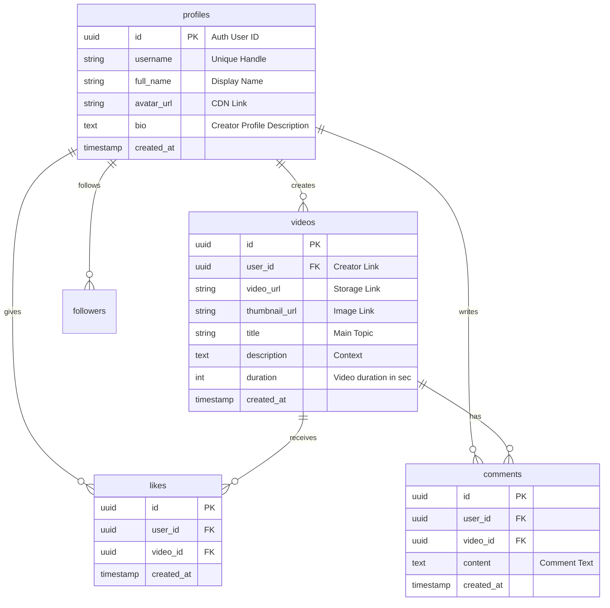

<div align="center">
  

  # DATARIOT
  ### *Content with Gravity. Logic Wins, Not Likes.*

  <p align="center">
    <a href="https://expo.dev"></a>
    <a href="https://supabase.com"></a>
    <a href="https://github.com/pmndrs/zustand"></a>
    <a href="https://nativewind.dev"></a>
    <a href="https://www.typescriptlang.org"></a>
  </p>
</div>

---

## 👁️ Philosophy & Vision

**Datariot** is a next-generation vertical video debate arena and cognitive feed platform. Designed as a high-fidelity alternative to mindless, dopamine-loop scrolling, Datariot shifts the focus to logic, structured discourse, and educational value. 

> [!NOTE]  
> **The Mission:** Transform short-form scrolling habits into an engine for intellectual growth. We filter the noise, rewarding well-constructed arguments, clear evidence, and verified reasoning.

---

## ⚡ Core Architectural Highlights

*   **Triple-View Feed Engine**: Fully integrated feeds including **Classic Loop Feed** (immersive vertical playback), **Mosaic Feed** (content discovery grids), and **Pulse Feed** (dynamic engagement cards) powered by high-performance Native components.
*   **Cognitive Physics Engine**: Fully fluid gesture system powered by `react-native-gesture-handler` and `react-native-reanimated` delivering a premium 60 FPS scrolling experience.
*   **Structured Arena & Battles**: Users record on-camera video arguments, allowing others to respond directly in a structured tree format rather than toxic text comments.
*   **Deep Dive & Fact Checking**: Overlay modals allowing viewers to examine sources, vote on logic quality, and flag factual inaccuracies in real-time.
*   **Obsidian Blue Design Language**: A sleek, dark user interface emphasizing premium glassmorphic overlays and high-end typography accents.

---

## 📂 Project Structure

```text
datariot/
├── assets/                    # Optimized assets, branding, and local fonts
├── scripts/                   # Seeding, cleanup, and deployment automation
├── src/
│   ├── app/                   # File-system routing via Expo Router
│   │   ├── (tabs)/            # Main tab navigation
│   │   │   ├── index.tsx      # Vertical video feed & View modes toggle
│   │   │   ├── discover.tsx   # Discovery, search, and category pills
│   │   │   ├── create.tsx     # Camera recording & media upload interface
│   │   │   └── profile.tsx    # User profile, statistics, and saved debates
│   │   ├── auth/              # Authentication screens
│   │   │   └── login.tsx      # Secure login & registration portal
│   │   └── _layout.tsx        # Global context providers and theme wrapper
│   ├── components/            # Reusable UI elements
│   │   ├── VideoPlayer/       # High-fidelity video decoding & controls wrapper
│   │   ├── VideoFeed/         # Virtualized list implementations (Classic, Mosaic, Pulse)
│   │   └── UI/                # Atomic design tokens (buttons, modals, blur containers)
│   ├── design-system/         # System design values
│   │   └── theme.ts           # Typography scale and Obsidian Blue palette
│   ├── lib/                   # Integrations and utilities
│   │   └── supabase/          # Database client, authentication, and hooks
│   └── store/                 # Global state management via Zustand
├── .env                       # Environment variables (private credentials)
├── app.json                   # Expo configuration file
└── package.json               # Dependencies and build scripts
```

---

## 🛠️ Enterprise Tech Stack

| Layer | Technology | Usage & Rationale |
| :--- | :--- | :--- |
| **Frontend** | React Native (Expo SDK 54) | Native performance across iOS, Android, and Web platforms. |
| **Routing** | Expo Router v3 | Safe, typed file-based navigation facilitating seamless deep linking. |
| **Animations** | Reanimated 4 & Worklets | Complex, stutter-free gestures calculated off the main thread. |
| **State** | Zustand | Unbound, lightweight, and atomic reactive store for state management. |
| **Styling** | NativeWind v4 (Tailwind) | Modern, atomic utility styling matching web-responsive breakpoints. |
| **Backend** | Supabase (PostgreSQL) | Fully cloud-hosted, real-time relational backend. |
| **Media** | Expo Video & AV | Optimized video decoding with background audio handling. |

---

## 📊 Database Schema & Security (Supabase ERD)

Our PostgreSQL schema is optimized for speed, integrity, and absolute client-side protection through Postgres Row Level Security (RLS).



### 🔒 Row Level Security (RLS) Rules

*   **`profiles`**: Public read access enabled. Update access restricted exclusively to the profile owner (`auth.uid() = id`).
*   **`videos`**: Insert permissions open to authenticated users. Update/delete restricted to original creators.
*   **`videos` Storage Bucket**: CDN read access is open to all. File uploads require an authenticated JWT session.

---

## 🎨 Design System: Obsidian Blue

Datariot relies on deep dark tones contrasting with neon azure accents, creating a spacious, high-fidelity experience optimized for OLED displays.

```text
█ #000000 - Background Primary (Absolute black for premium energy savings)
█ #0A0A0A - Background Secondary (Deep obsidian surface)
█ #D9E4FF - Brand Primary (Vivid Ice Blue highlight)
█ #BDEBFF - Accent Teal (Neon cyan border glow)
█ #1A1A1A - Surface Dark (Cards, list tiles, and blurred headers)
```

*   **Fonts**: `Inter` for regular text, `Oxanium` for metadata tabs and labels, and `Syncopate` for minimal, high-tech brand headlines.
*   **Micro-interactions**: Spring physical feedback on buttons, smooth fade-ins on overlay widgets, and automatic play-state management.

---

## 🚀 Setup & Installation

### 1. Prerequisite Packages

Clone the project and pull dependencies:

```bash
git clone https://github.com/your-repo/datariot.git
cd datariot
npm install
```

### 2. Provision Supabase Backend

1.  Create a project on [Supabase](https://supabase.com).
2.  Deploy the tables and triggers via the **SQL Editor**.
3.  Go to **Storage** and create a public bucket named `videos`.
4.  Activate **Email Sign-in** under Authentication Providers.

### 3. Update Environment Keys

Create a `.env` file in the root of the project directory:

```env
EXPO_PUBLIC_SUPABASE_URL=https://your-project-id.supabase.co
EXPO_PUBLIC_SUPABASE_ANON_KEY=eyJhbGciOiJIUzI1NiIsInR5cCI6IkpXVCJ9...
SUPABASE_SERVICE_ROLE_KEY=eyJhbGciOiJIUzI1NiIsInR5cCI6IkpXVCJ9.service_role...
```

### 4. Boot Development Servers

```bash
# Start Metro Bundler with ngrok tunneling for local devices
npm run start:tunnel

# Launch on iOS Simulator
npm run ios

# Launch on Android Emulator
npm run android
```

---

## 📈 Strategic Roadmap

### Phase 1: Core Experience 🟢
*   [x] Immersive full-screen loops with multiple feeds (Classic & Mosaic).
*   [x] Secure authentication, session persistence, and profile creation.
*   [x] Basic interactions (likes, comments, profile follows).
*   [x] Dynamic safe area handling covering camera notches and screen shapes.

### Phase 2: Content Studio & Intelligence 🟡
*   [ ] Local recording module with video editing and client-side compression.
*   [ ] Real-time speech-to-text generating high-fidelity subtitles automatically.
*   [ ] Comprehensive debate challenge engine (direct video responses and node linking).
*   [ ] Offline-first cache manager (`expo-file-system`).

### Phase 3: Global Scale & AI 🔴
*   [ ] Recommendation engine utilizing user behavior embedding matches.
*   [ ] Creator monetization channels via integrated micro-payments.
*   [ ] Premium Web app desktop experience optimized for monitors.
*   [ ] Creator verified badges validating credentials and background.

---

## 🤝 Contributing

We welcome additions, fixes, and architectural proposals to Datariot:
1. Fork this repository.
2. Create your branch (`git checkout -b feature/NewFeature`).
3. Commit changes (`git commit -m 'feat: add new feed view'`).
4. Open a Pull Request.

---

**Datariot** — Learn Deeply. Think Critically. Debate Fairly. 🧠💡
